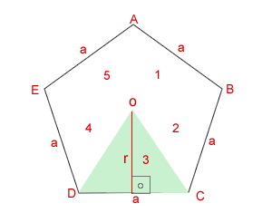

# python-project

* [3 max number of array](./3max.py)
* [Convert Celsius to Fahrenheit](./Celsius2Fahrenheit.py)
* [Calculate Loan Mortgage Payment](./loan.py)
* [Convert MilliSecond ot Hour, Minute & Second](./millisec.py)
* [Convert Current time ot Hour, Minute, Second & MilliSecond](./millisec.realtime.py)
* [Calculate Sales Commission](./salescommission.py)
* [Calculate Pentagon area & perimeter](./pentagon.py)
